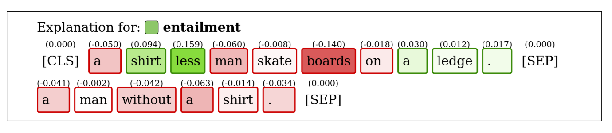
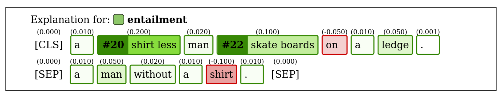

# [pe]rturbable [t]ext [e]xplanations

Contains implementations of explanation methods LIME and IME and their modifications.
The modifications use a text generator to create more natural perturbations.
In total, there are two base methods (LIME, IME) and three modifications (LIME+LM, IME + internal LM, IME + external LM).

**NOTE**: breaking changes are very likely in the future (including a name change to match the repo), use with caution.

## Minimal example

```python
from explain_nlp.modeling.modeling_transformers import InterpretableBertForSequenceClassification
from explain_nlp.generation.generation_transformers import BertForMaskedLMGenerator
from explain_nlp.methods.lime_lm import LIMEMaskedLMExplainer

# The explained model, in this case a fictional NLI classifier
model = InterpretableBertForSequenceClassification(
    model_name="my-finetuned-snli-model", tokenizer_name="my-finetuned-snli-model",
    batch_size=8, max_seq_len=41, device="cpu"
)

# The generator of the perturbations, in this case a pre-trained bert-base-uncased LM
generator = BertForMaskedLMGenerator(
    model_name="bert-base-uncased", tokenizer_name="bert-base-uncased",
    batch_size=8, max_seq_len=41, device="cpu",
    strategy="top_p", top_p=0.9
)

# shared_vocabulary=True skips the conversion between explained model, and generator representation
# Only use this if the vocabularies are shared, e.g., if the model and generator are both derived from "bert-base-uncased"
explainer = LIMEMaskedLMExplainer(model, generator=generator, kernel_width=1.0, 
                                  shared_vocabulary=True,
                                  return_samples=True, return_scores=True)


# Explain prediction for class 0 of interpreted model
res = explainer.explain_text(
    ("A shirtless man skateboards on a ledge.", "A man without a shirt."), label=0, 
    num_samples=100
)

# Explained (sub)words and their importance
print(res["input"])
print(res["importance"])

```

## Visualization

Analyzing the (sub)word importance through plain text can be annoying, so the package offers 
a highlight plot visualization that highlights the important units **for** the predicted label
with green, and important units **against** the predicted label with red. 
Continuing from the previous example, we can visualize the explanation with following code.

```python3
from explain_nlp.visualizations.highlight import highlight_plot

highlight_plot([res["input"]],
               importances=[res["importance"].tolist()],
               pred_labels=["entailment"],
               actual_labels=["entailment"],
               path="my_visualization.html",
               skip_tokens=["[PAD]"])
```

This will store the following visualization into the file `my_visualization.html`. By providing 
`skip_tokens=["PAD"]` we are skipping the visualization for `[PAD]` tokens as those are unimportant.



If the explanation is computed for longer units, such as words (where a word may contain multiple subwords), 
the argument `custom_features` must be provided, specifying how the primary units (subwords) are combined 
into longer units (words).

Let's say we compute a word-based explanation (using `WordExplainer`*) for sentence pair used above, getting 
the following explanation.
```python
import torch

res = {
    "input": ["[CLS]", "a", "shirt", "less", "man", "skate", "boards", "on", "a", "ledge", ".", "[SEP]",
              "a", "man", "without", "a", "shirt", ".", "[SEP]"],
    "importance": torch.tensor([0.0, 0.0, 0.0, 0.0, 0.0, 0.0, 0.0, 0.0, 0.0, 0.0, 0.0, 0.0,
                                0.0, 0.0, 0.0, 0.0, 0.0, 0.0, 0.0,
                                0.01, 0.2, 0.02, 0.1, -0.05, 0.01, 0.05, 0.001,
                                0.01, 0.05, 0.02, 0.01, -0.1, 0.01]),
    "custom_features": [[1], [2, 3], [4], [5, 6], [7], [8], [9], [10],
                        [12], [13], [14], [15], [16], [17]]
}
```

The explanation is similar to the previous one, but now the importance is provided for words, which are 
sometimes made up of multiple subwords. The conversion is provided in `res["custom_features"]`, for example
the first word (index 0) inside custom features is made up of the token "a" (subword at index 1), 
the second word (index 1) is made up of the tokens ["shirt", "less"] (subwords at indices 2 and 3), and so on.
Notice that the importance of custom features is stored after importance of primary units (in this case after 
19 zeroes).

To create the visualization, they custom feature groups need to be provided with `custom_features`. 
```python3
from explain_nlp.visualizations.highlight import highlight_plot

highlight_plot([res["input"]],
               importances=[res["importance"].tolist()],
               pred_labels=["entailment"],
               actual_labels=["entailment"],
               custom_features=[res["custom_features"]],
               path="my_visualization.html",
               skip_tokens=["[PAD]"])
```



The numbers in front of words (e.g., `#20`) are IDs that allow matching longer units in case they are made up of units that
are scattered throughout the text.


`*` More advanced examples will be added in the future.